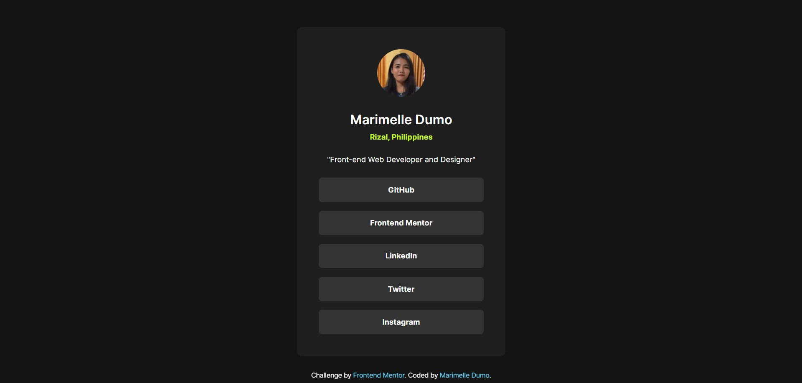

# Frontend Mentor - Social links profile solution

This is a solution to the [Social links profile challenge on Frontend Mentor](https://www.frontendmentor.io/challenges/social-links-profile-UG32l9m6dQ). Frontend Mentor challenges help you improve your coding skills by building realistic projects. 

## Table of contents

- [Overview](#overview)
  - [The challenge](#the-challenge)
  - [Screenshot](#screenshot)
  - [Links](#links)
- [My process](#my-process)
  - [Built with](#built-with)
  - [What I learned](#what-i-learned)
  - [Continued development](#continued-development)
- [Author](#author)

## Overview

### The challenge

Users should be able to:

- See hover and focus states for all interactive elements on the page

### Screenshot

### Links

- Solution URL: [https://github.com/Marimelle/social-links-profile](https://github.com/Marimelle/social-links-profile)

- Live Site URL: [https://marimelle.github.io/social-links-profile/](https://marimelle.github.io/social-links-profile/)

## My process

### Built with

- Semantic HTML5 markup for improved accessibility

- CSS custom properties

- Flexbox and media query for the layout

- Responsive sizing using `rem`

- Interactive elements using `transition`, `cursor` styling and pseudo-classes (for `focus`, `hover` and `active` states)

### What I learned

**1. Keeping things organized**

  - Used CSS variables to easily change colors everywhere at once

  - Grouped similar styles together (like all font rules in one place)

**2. Making it work on all devices**

  - Made the card shrink properly on mobile screens using `@media` query

  - Used relative units (`rem`) so that everything scales together. I used the base font of `16px` to be equal to `1rem`.

**3. Better User Experience**

  - Added smooth color changes when hovering on links

  - Designed clear focus states for keyboard users as well

**4. Handy Tricks**

  - `aspect-ratio` property kept my profile picture perfectly round

  - Used `gap` property so I don't have to calculate the margins of multiple elements

  - Linked Local fonts because they loaded faster than Google web fonts

**5. Problem-Solving**

  - Fixed image stretching issues

  - Learned how to make transitions feel natural

  - Got better at using browser tools to test my design

### Continued development

- I struggled to get accurate measurements for the elements and spacing since I only had a screenshot of the webpage/design to work with. Without access to the original Figma file, I had to recreate the entire layout manually in Figma.

- Fortunately, all those Figma tutorials and practice projects I did on my own really paid off. I was able to figure it out and finish my mockup on Figma.

- I’m planning to dive deeper into Figma to streamline my workflow. Mastering Figma will really help me create mockups faster and jump into coding more efficiently.

## Author

- Github - [Marimelle Dumo](https://github.com/Marimelle)

- Frontend Mentor - [@Marimelle](https://www.frontendmentor.io/profile/Marimelle)
